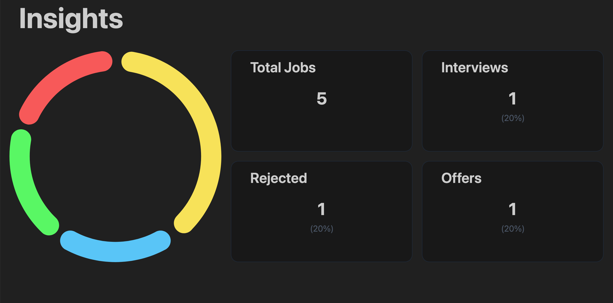
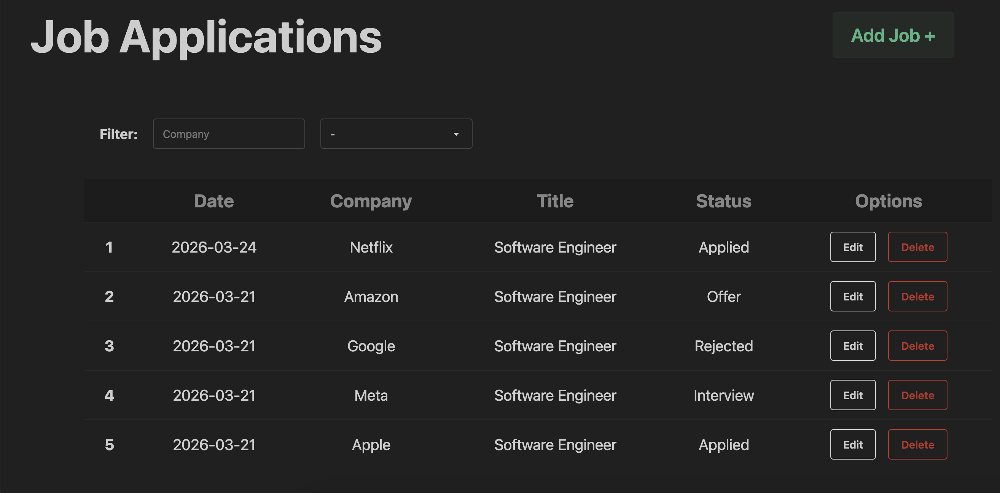
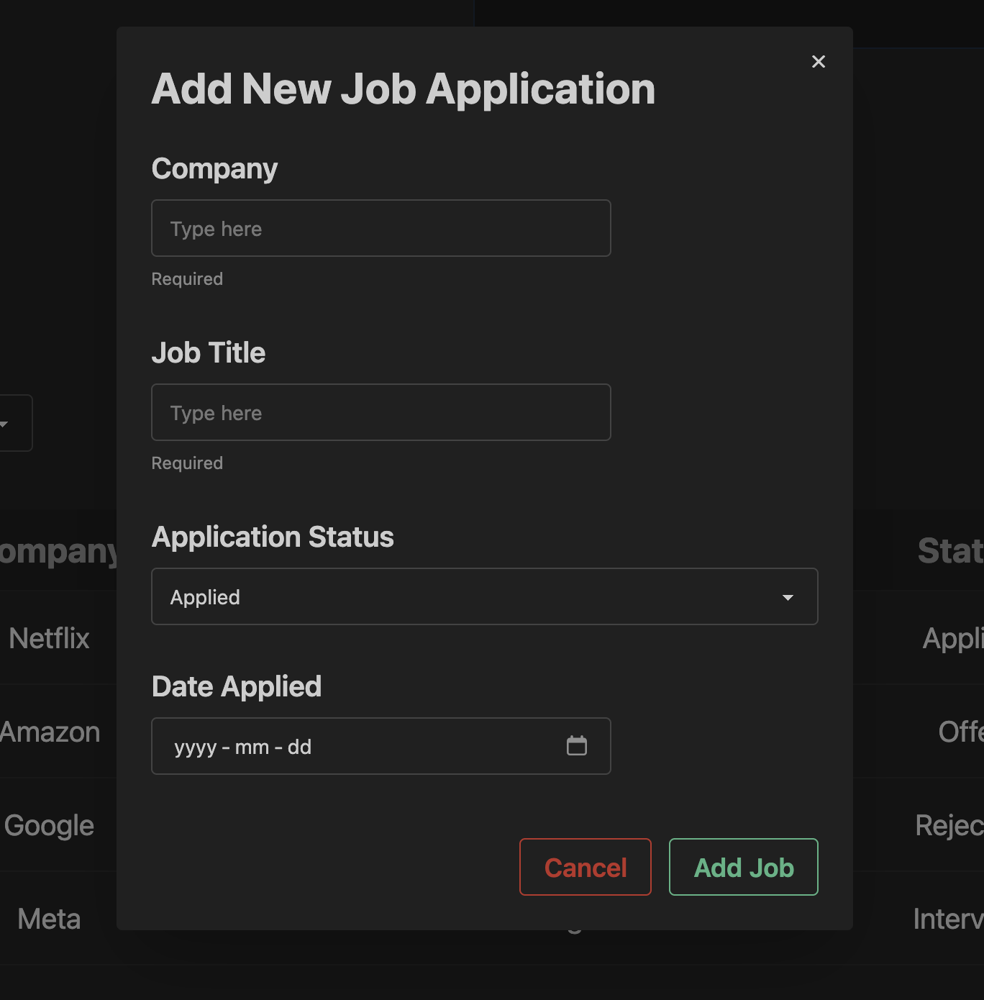

<p align="left">
  
  
  
  
  
  
</p>

# Job Application Tracker

A full-stack web application to track job applications, manage interview stages, and visualize job search progress.

---

## Live Demo

[Job Tracker](https://job-application-tracker-frontend-lxpq.onrender.com)

---

## Features

* Google Authentication (Firebase)
* Add, edit, and delete job applications
* Dashboard with statistics and pie chart insights
* Filter by company and status
* Toast notifications for actions
* Rate limiting with Redis (API protection)

---

## Tech Stack

### Frontend

* React
* Vite
* Tailwind CSS + DaisyUI
* Axios
* Chart.js

### Backend

* Node.js
* Express
* MongoDB (Mongoose)
* Firebase Admin SDK (authentication)
* Redis (rate limiting)

### Deployment

* Render (frontend + backend)

---

## Screenshots

### Insights



### Job Applications



### Add Job Modal



---

## Environment Variables

### Frontend (`.env`)

VITE_API_URL=http://localhost:5001

### Backend (`.env`)

MONGODB_URI=your_mongodb_uri \
FIREBASE_SERVICE_ACCOUNT=your_json_string \
FRONTEND_URL=http://localhost:5173 \
REDIS_URL=your_redis_connection_string

---

## Getting Started

### 1. Clone the repo
```
git clone https://github.com/jdylantapp/job-application-tracker.git
cd job-application-tracker
```
---

### 2. Install dependencies

#### Backend
```
cd backend
npm install
```
#### Frontend
```
cd frontend
npm install
```
---

### 3. Run locally

#### Backend
```
npm run dev
```
#### Frontend
```
npm run dev
```
---

## Future Improvements

* CSV import for job applications
* Unit & integration tests
* Demo mode

---

## License

This project is for educational and portfolio purposes.

